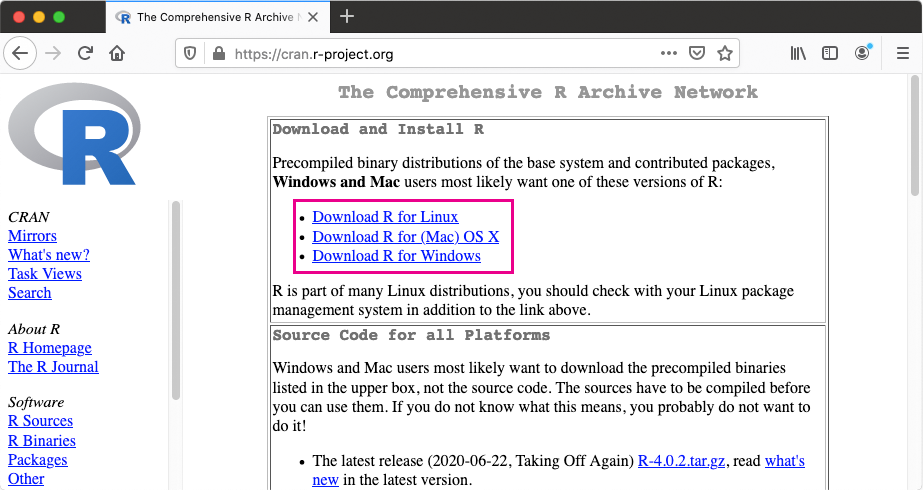
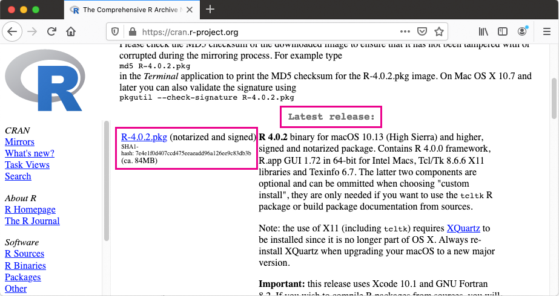
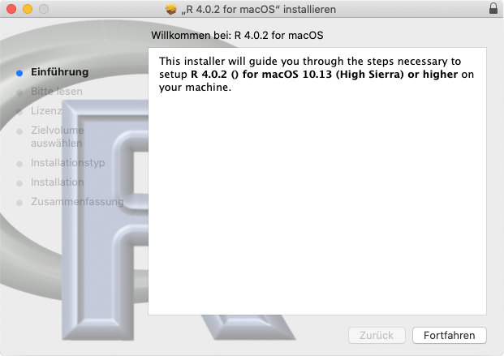
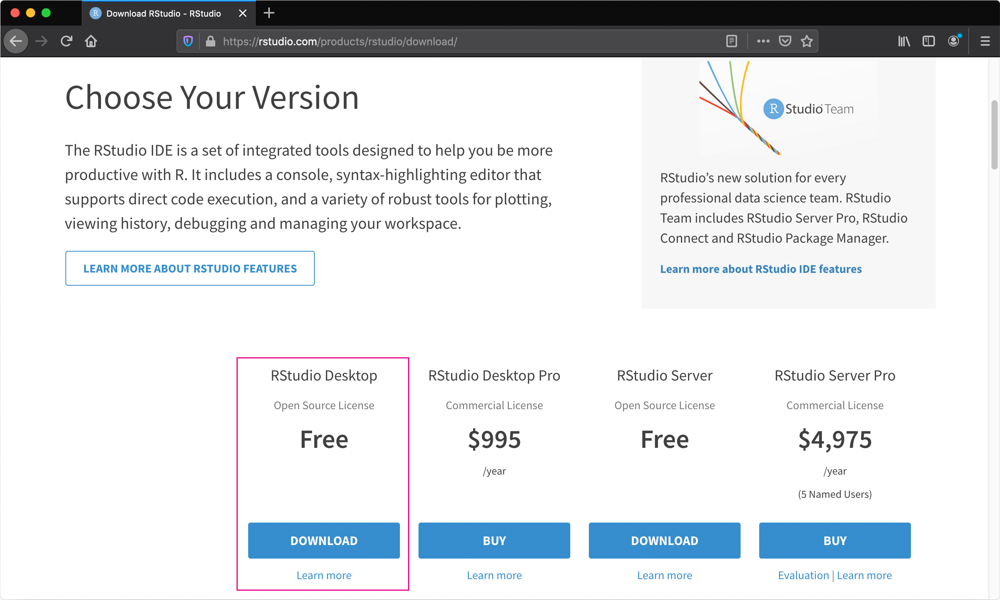
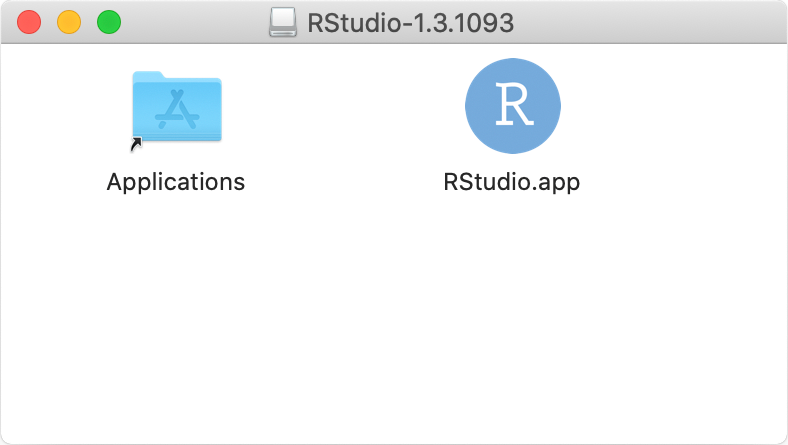

---
jupyter:
  jupytext:
    text_representation:
      extension: .Rmd
      format_name: rmarkdown
      format_version: '1.1'
      jupytext_version: 1.1.1
  kernelspec:
    display_name: R
    language: R
    name: ir
---

# Installationsanleitung MacOS

Wie auf den vorhergehenden Seiten beschrieben, handelt es sich bei R und RStudio um zwei unterschiedliche Dinge:
1. R, die Programmiersprache
2. RStudio, die Entwicklungsumgebung

Zur Installation müssen Sie deshalb auch **beides nacheinander** installieren. 

## Erster Schritt: R
Die aktuelle Version von R können Sie über das CRAN downloaden. Die Webadresse lautet:  [https://cran.r-project.org/](https://cran.r-project.org). Gleich auf der Startseite finden Sie die Links zu den jeweils aktuellsten R-Versionen:

Klicken Sie auf der [Homepage des CRAN](https://cran.r-project.org) auf "Download R for (Mac) OSX" und scrollen Sie bis zu den "Latest Releases". Unter dieser Überschrift wird Ihnen die aktuellste "stable" Version von R angezeigt. 

Während diese Dokumentation geschrieben wurde war dies die Version 4.0.2, wie der nachfolgende Screenshot zeigt:

Rechtsklicken Sie auf die Version und laden Sie sie herunter.

Doppelklicken Sie auf die heruntergeladene Datei und folgen Sie der Installationsanleitung.

## Zweiter Schritt: RStudio

RStudio, die Entwicklungsumgebung für R können Sie unter [https://rstudio.com/products/rstudio/download/](https://rstudio.com/products/rstudio/download/) herunterladen.

Wählen Sie die Version "RStudio Desktop - Free" und laden Sie die Datei herunter.

Nachdem der Download abgeschlossen ist, doppelklicken Sie die Datei und ziehen Sie sie in Ihre Applications.

Nach der Installation können Sie das Programm RStudio öffnen. Es greift automatisch auf die zuvor installierte Version von R zu.
